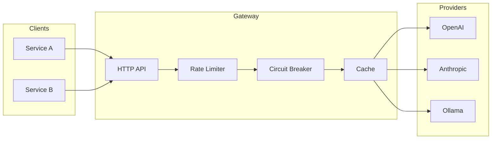

# AI Gateway

A centralized proxy for LLM requests with multi-provider support, automatic fallback, cost tracking, and observability.

## Problem

Companies integrating LLMs in production face:
- **Vendor lock-in** — No fallback when provider goes down
- **Uncontrolled costs** — No visibility into spending per service
- **Rate limits** — Requests fail during peak usage
- **Scattered secrets** — API keys in every microservice

## Solution

AI Gateway is an **OpenAI-compatible proxy** that:
- Abstracts multiple providers (OpenAI, Anthropic, Bedrock, Ollama)
- Provides automatic fallback and circuit breaker
- Tracks costs per tenant
- Centralizes observability with OpenTelemetry

```go
// Any service using OpenAI SDK can switch to the gateway
client := openai.NewClient("gw-xxx", openai.WithBaseURL("http://aigateway:8080/v1"))
```

## Features

- **Multi-provider** — OpenAI, Anthropic, AWS Bedrock, Ollama
- **Automatic fallback** — If provider A fails, tries provider B
- **Circuit breaker** — Isolates failing providers
- **Rate limiting** — Per-tenant request quotas
- **Cost tracking** — Per-request cost calculation
- **Response caching** — Cache deterministic responses
- **Streaming (SSE)** — Real-time chat responses
- **OpenTelemetry** — Distributed tracing and metrics

## Quick Start

### Prerequisites

- Go 1.22+
- Docker & Docker Compose
- Ollama (for local testing)

### Run locally

```bash
# Start infrastructure
docker compose up -d postgres redis

# Run migrations
make migrate-up

# Start Ollama (for free local testing)
ollama run llama3:8b

# Run the gateway
make run
```

### Test with curl

```bash
# Create a tenant
curl -X POST http://localhost:8080/admin/tenants \
  -H "Content-Type: application/json" \
  -d '{"name": "test-service", "rate_limit_rpm": 100}'

# Make a request (using Ollama)
curl -X POST http://localhost:8080/v1/chat/completions \
  -H "Authorization: Bearer gw-sk-xxx" \
  -H "Content-Type: application/json" \
  -d '{
    "model": "llama3:8b",
    "messages": [{"role": "user", "content": "Hello!"}]
  }'
```

## Architecture



## Documentation

- [Technical Specification](docs/spec.md)
- [Architecture Decision Records](docs/adr/)

## Development

```bash
# Run tests
make test

# Run tests with race detector
make test-race

# Run linter
make lint

# Run with hot reload
make dev
```

## Roadmap

- [x] Project setup
- [ ] v0.1.0 — Basic proxy + OpenAI + Ollama + rate limiting
- [ ] v0.2.0 — Anthropic + fallback + circuit breaker
- [ ] v0.3.0 — Cost tracking + streaming + OpenTelemetry
- [ ] v0.4.0 — AWS Bedrock + SQS/SNS integration

## License

MIT
