# AI Gateway - Architecture Diagrams

This document contains Mermaid diagrams illustrating the main flows and architecture of the AI Gateway.

---

## 1. High-Level Architecture

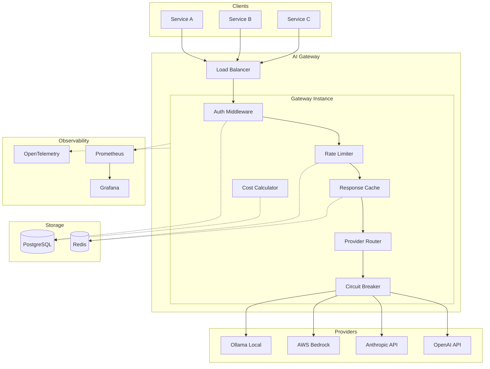

---

## 2. Request Flow - Chat Completion

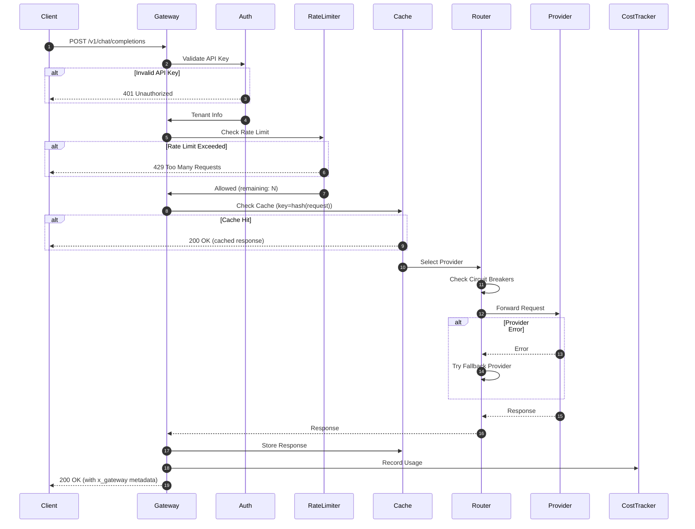

---

## 3. Provider Fallback with Circuit Breaker

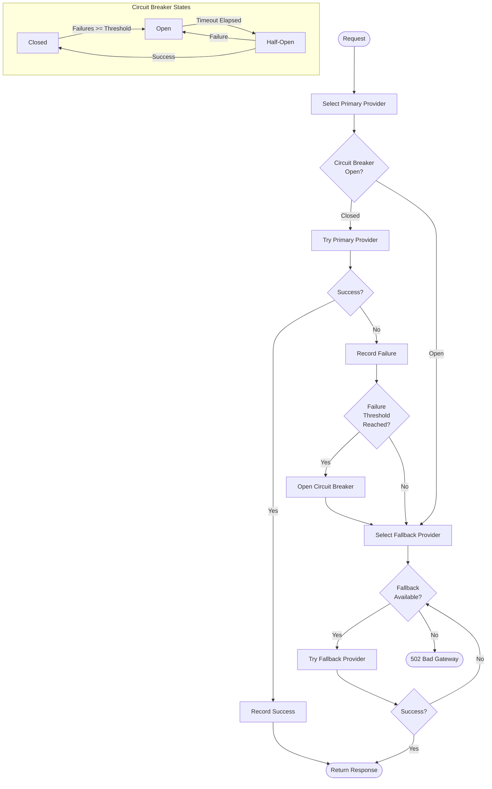

---

## 4. Rate Limiting Flow

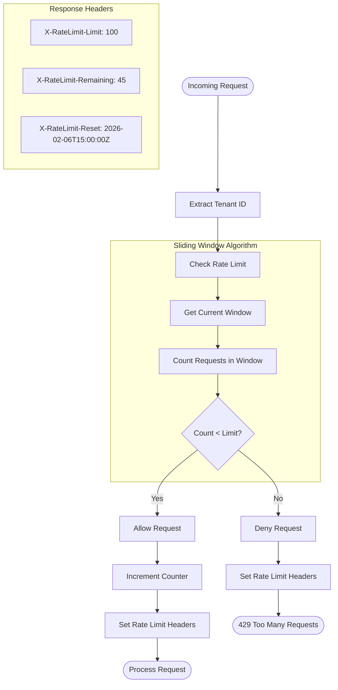

---

## 5. Cost Tracking & Budget Monitoring

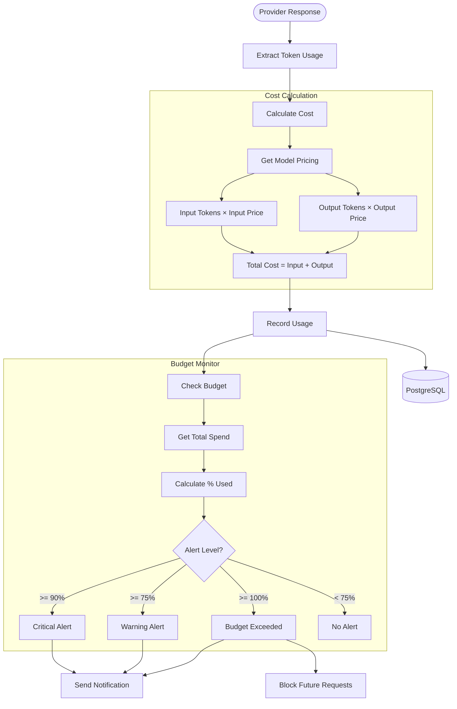

---

## 6. Authentication & RBAC Flow

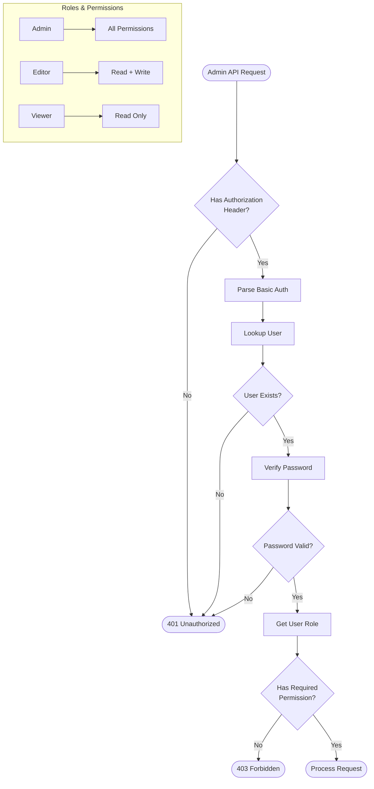

---

## 7. Streaming Response Flow (SSE)

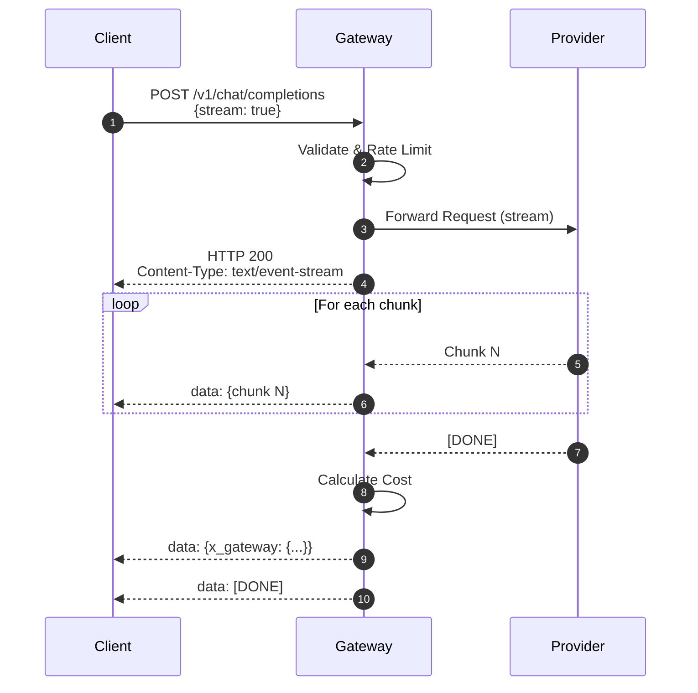

---

## 8. Cache Key Generation

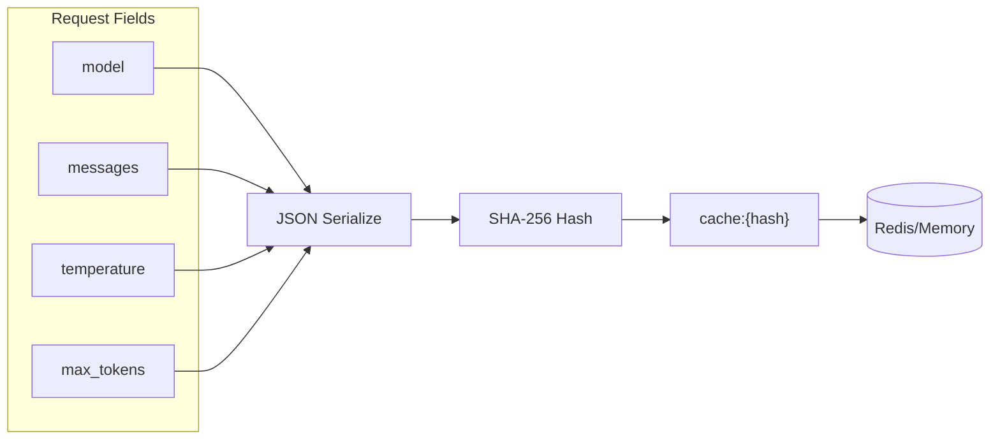

---

## 9. Component Dependencies

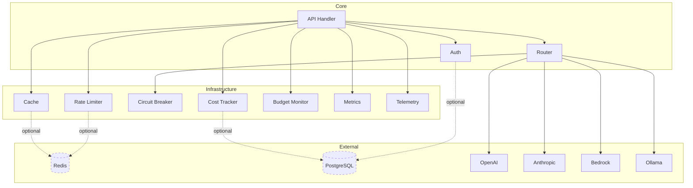

---

## 10. Horizontal Scaling Architecture (Planned)

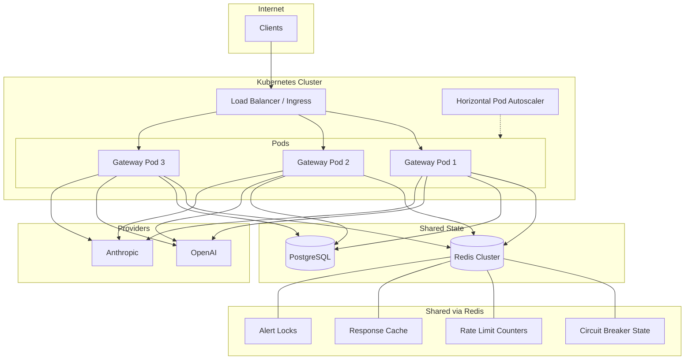

---

## 11. Graceful Shutdown Flow

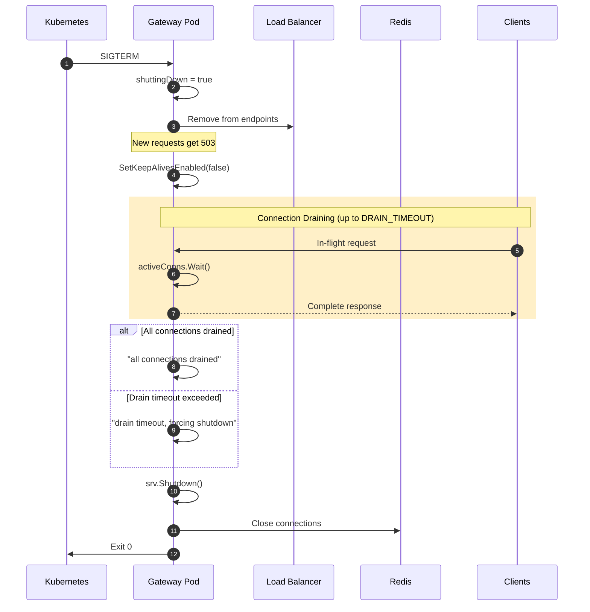

---

## 12. Distributed Circuit Breaker State Machine

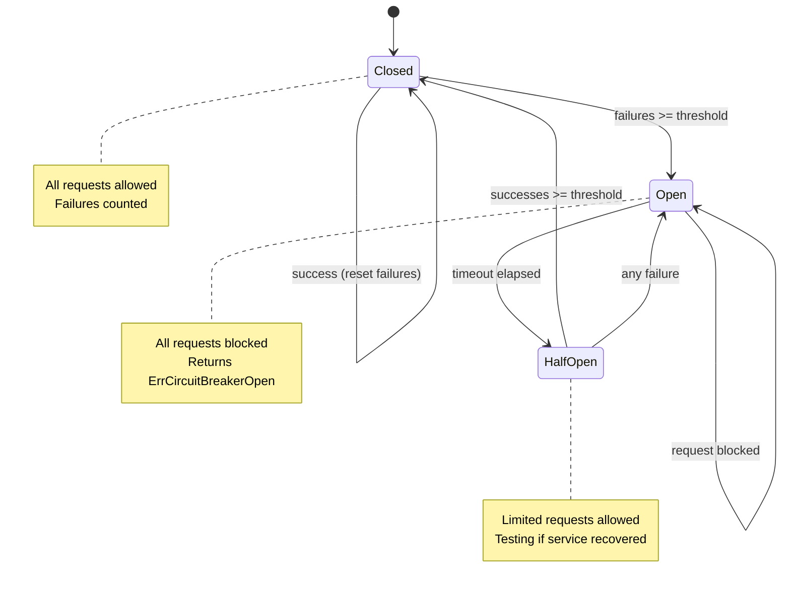

---

## 13. Health Check Decision Flow

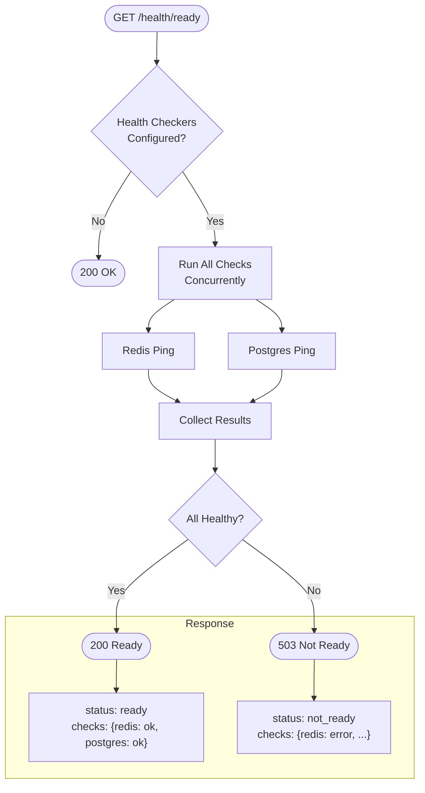

---

## Viewing These Diagrams

These diagrams use [Mermaid](https://mermaid.js.org/) syntax and can be rendered:

1. **GitHub** - Renders automatically in markdown files
2. **VS Code** - Install "Markdown Preview Mermaid Support" extension
3. **Online** - Use [Mermaid Live Editor](https://mermaid.live/)
4. **Documentation** - Tools like Docusaurus, MkDocs support Mermaid
