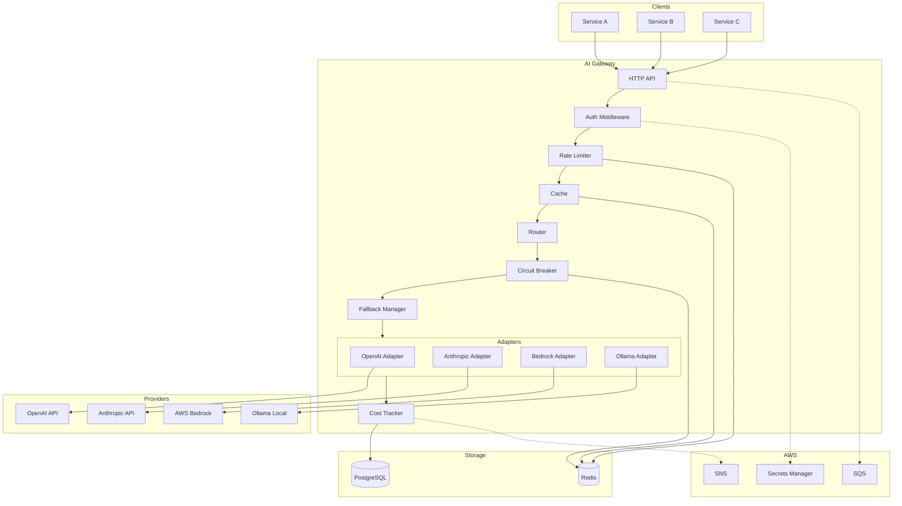
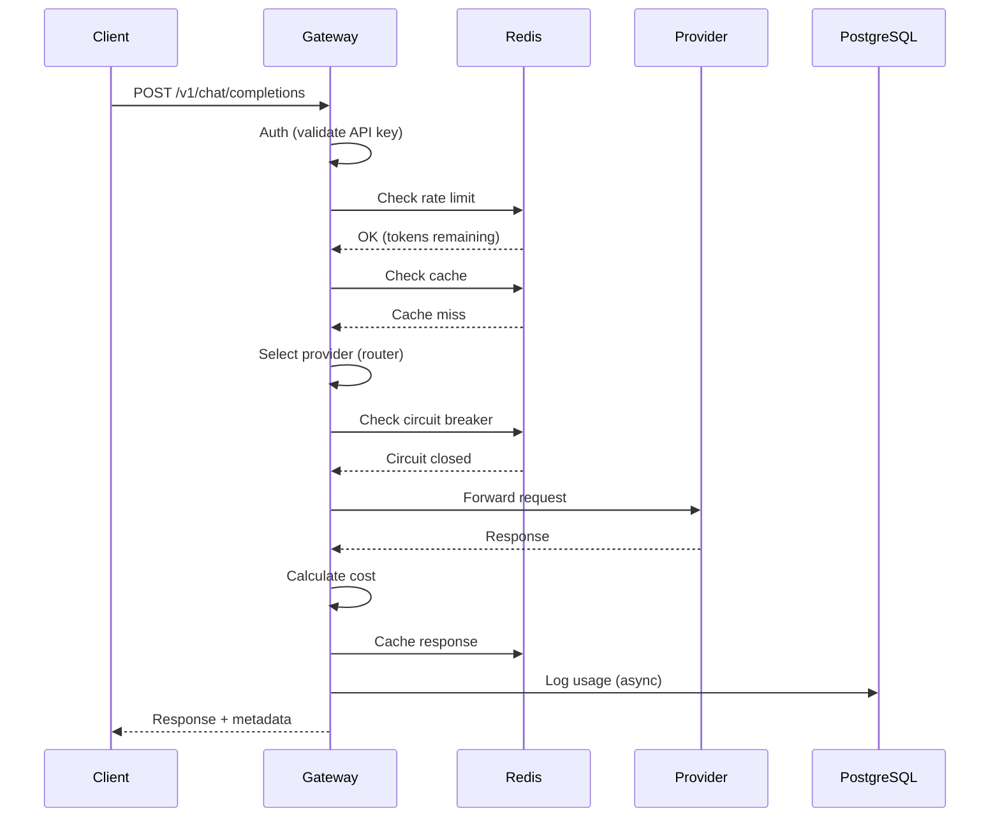
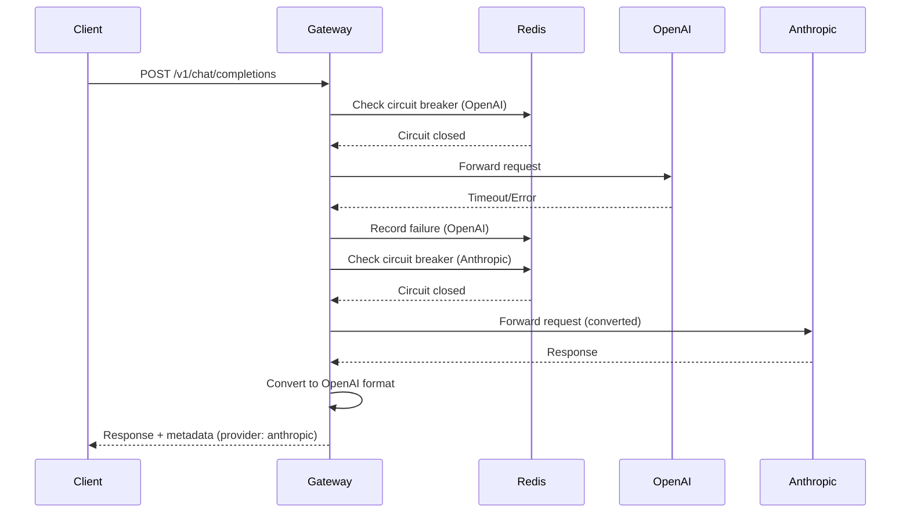
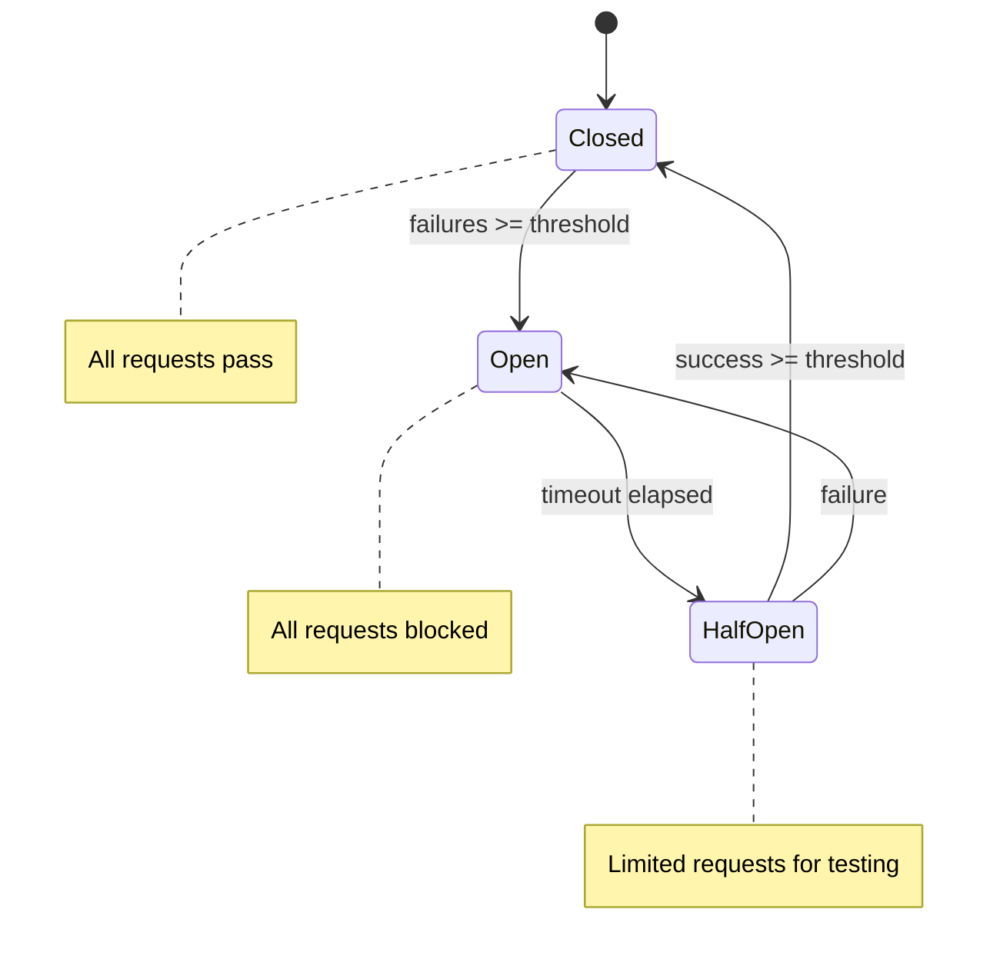

# AI Gateway — Technical Specification

> **Version:** 0.1.0  
> **Status:** Draft  
> **Last updated:** 2026-02-04

---

## 1. Problem

Companies integrating LLMs in production face concrete problems:

| Problem | Impact |
|---------|--------|
| **Vendor lock-in** | If OpenAI goes down, the system stops. No fallback, no resilience. |
| **Uncontrolled costs** | No visibility into how much each service/feature spends. Billing surprises. |
| **Rate limits** | OpenAI has aggressive limits. During peak usage, requests fail. |
| **Unpredictable latency** | Without fallback, users wait 30s+ timeout when provider is slow. |
| **Scattered secrets** | API keys in every microservice = larger attack surface. |
| **Auditing** | Need to log requests for compliance, but duplicating code in every service is unfeasible. |

### Target Use Case (FinAI)

A FinAI (financial intelligence) team needs:
- Multiple services consuming LLMs for conversational experience
- Strict cost control (fintech = tight margins)
- Request auditing (financial regulation)
- High availability (user cannot be left without response)

### Central Question

> *"How to allow multiple internal services to consume LLMs reliably, economically, and auditably, without each one implementing retry, fallback, rate limiting, and cost tracking?"*

---

## 2. Solution

**AI Gateway** — A centralized proxy for LLM requests that:

1. **Abstracts providers** — OpenAI, Anthropic, AWS Bedrock, Ollama behind a single API
2. **Ensures resilience** — Automatic fallback, circuit breaker, retry
3. **Controls costs** — Tracking per tenant, budget alerts
4. **Centralizes observability** — OpenTelemetry, metrics, structured logs
5. **Simplifies security** — API keys in one place

### Key Differentiator

The gateway is **OpenAI-compatible**. Any service already using the OpenAI SDK can point to the gateway without changing code:

```go
// Before
client := openai.NewClient("sk-xxx")

// After — only change the base URL
client := openai.NewClient("gw-xxx", openai.WithBaseURL("http://aigateway:8080/v1"))
```

---

## 3. Scope

### 3.1 Included (MVP)

| Feature | Description |
|---------|-------------|
| **Request proxy** | Receives OpenAI-compatible request, routes to provider |
| **Multi-provider** | OpenAI, Anthropic (Claude), AWS Bedrock, Ollama |
| **Automatic fallback** | If provider A fails/times out, tries provider B |
| **Circuit breaker** | Isolates provider with consecutive failures |
| **Rate limiting per tenant** | Each project/service has request/min quota |
| **Cost tracking** | Calculates cost per request (tokens × model price) |
| **Budget alerts** | Publishes SNS event when tenant reaches X% of budget |
| **Response caching** | Cache identical responses (same prompt + params = same result) |
| **Streaming (SSE)** | Real-time responses for chat |
| **OpenTelemetry** | Distributed tracing, metrics, structured logs |
| **AWS Secrets Manager** | Centralized provider API keys (optional) |
| **SQS async mode** | Queue for batch/async requests |

### 3.2 Out of Scope

| Feature | Reason |
|---------|--------|
| Prompt templates/engineering | Consumer service responsibility |
| Fine-tuning | Rare operation, done directly on provider |
| Embeddings/Vector search | Different problem, separate project |
| UI/Dashboard | API only, dashboards via Grafana |
| Complex multi-tenancy | Simple auth by API key, no RBAC |
| Real billing | Tracking only, no charging |

### 3.3 Non-Goals

- **Not an agent framework** — Just a request proxy
- **No prompt injection detection** — Can be added later
- **No conversation persistence** — Stateless, context comes in request

---

## 4. Architecture

### 4.1 Component Diagram



### 4.2 Request Flow (Sync)



### 4.3 Fallback Flow



### 4.4 Circuit Breaker States



---

## 5. API

### 5.1 OpenAI-Compatible Endpoints

These endpoints are drop-in replacements for the OpenAI API:

#### POST /v1/chat/completions

Proxy for chat completions. Supports sync and streaming.

**Request:**
```json
{
  "model": "gpt-4",
  "messages": [
    {"role": "system", "content": "You are a helpful assistant."},
    {"role": "user", "content": "Hello!"}
  ],
  "temperature": 0.7,
  "max_tokens": 1000,
  "stream": false
}
```

**Headers:**
| Header | Required | Description |
|--------|----------|-------------|
| `Authorization` | Yes | `Bearer gw-xxx` (gateway API key) |
| `X-Provider` | No | Force specific provider: `openai`, `anthropic`, `bedrock`, `ollama` |
| `X-Cache-TTL` | No | Cache TTL in seconds (0 = no cache) |
| `X-Request-ID` | No | ID for correlation (generated if absent) |

**Response (sync):**
```json
{
  "id": "chatcmpl-abc123",
  "object": "chat.completion",
  "created": 1707069600,
  "model": "gpt-4",
  "choices": [
    {
      "index": 0,
      "message": {
        "role": "assistant",
        "content": "Hello! How can I help you today?"
      },
      "finish_reason": "stop"
    }
  ],
  "usage": {
    "prompt_tokens": 20,
    "completion_tokens": 10,
    "total_tokens": 30
  },
  "x_gateway": {
    "provider": "openai",
    "latency_ms": 1234,
    "cost_usd": 0.0018,
    "cache_hit": false,
    "request_id": "req_xyz789",
    "trace_id": "abc123def456"
  }
}
```

**Response (streaming):**
```
data: {"id":"chatcmpl-abc123","choices":[{"delta":{"content":"Hello"}}]}

data: {"id":"chatcmpl-abc123","choices":[{"delta":{"content":"!"}}]}

data: {"id":"chatcmpl-abc123","choices":[{"delta":{},"finish_reason":"stop"}]}

data: {"x_gateway":{"provider":"openai","latency_ms":1234,"cost_usd":0.0018}}

data: [DONE]
```

#### GET /v1/models

Lists models available through the gateway.

**Response:**
```json
{
  "object": "list",
  "data": [
    {
      "id": "gpt-4",
      "object": "model",
      "owned_by": "openai",
      "x_gateway": {
        "provider": "openai",
        "cost_per_1k_input": 0.03,
        "cost_per_1k_output": 0.06
      }
    },
    {
      "id": "claude-3-sonnet",
      "object": "model",
      "owned_by": "anthropic",
      "x_gateway": {
        "provider": "anthropic",
        "cost_per_1k_input": 0.003,
        "cost_per_1k_output": 0.015
      }
    },
    {
      "id": "llama3:8b",
      "object": "model",
      "owned_by": "ollama",
      "x_gateway": {
        "provider": "ollama",
        "cost_per_1k_input": 0,
        "cost_per_1k_output": 0
      }
    }
  ]
}
```

### 5.2 Management Endpoints

#### POST /admin/tenants

Creates a new tenant (consumer service).

**Request:**
```json
{
  "name": "billing-service",
  "budget_usd": 1000.00,
  "rate_limit_rpm": 100,
  "allowed_models": ["gpt-4", "claude-3-sonnet"],
  "default_provider": "openai",
  "fallback_providers": ["anthropic", "ollama"]
}
```

**Response:**
```json
{
  "id": "tenant_abc123",
  "api_key": "gw-sk-xxxxxxxxxxxx",
  "name": "billing-service",
  "created_at": "2026-02-04T17:00:00Z"
}
```

#### GET /admin/tenants/:id/usage

Returns tenant usage.

**Query params:**
- `from`: Start date (ISO 8601)
- `to`: End date (ISO 8601)
- `group_by`: `day`, `hour`, `model`

**Response:**
```json
{
  "tenant_id": "tenant_abc123",
  "period": {
    "from": "2026-02-01T00:00:00Z",
    "to": "2026-02-04T23:59:59Z"
  },
  "summary": {
    "total_requests": 15420,
    "total_tokens": 2500000,
    "total_cost_usd": 125.50,
    "cache_hit_rate": 0.23,
    "avg_latency_ms": 890
  },
  "by_model": [
    {
      "model": "gpt-4",
      "requests": 5000,
      "tokens": 1000000,
      "cost_usd": 100.00
    }
  ]
}
```

#### GET /health

Health check for load balancers and Kubernetes.

**Response:**
```json
{
  "status": "healthy",
  "version": "1.0.0",
  "checks": {
    "database": "ok",
    "redis": "ok",
    "providers": {
      "openai": "ok",
      "anthropic": "ok",
      "ollama": "ok",
      "bedrock": "degraded"
    }
  }
}
```

#### GET /metrics

Prometheus metrics.

---

## 6. Internal Components

### 6.1 Provider Adapters

Each provider has an adapter implementing the interface:

```go
type Provider interface {
    // ID returns unique provider identifier
    ID() string
    
    // ChatCompletion executes synchronous request
    ChatCompletion(ctx context.Context, req ChatRequest) (*ChatResponse, error)
    
    // ChatCompletionStream executes streaming request
    ChatCompletionStream(ctx context.Context, req ChatRequest) (<-chan StreamChunk, error)
    
    // Models returns available models
    Models(ctx context.Context) ([]Model, error)
    
    // HealthCheck verifies if provider is responding
    HealthCheck(ctx context.Context) error
}
```

**Implemented adapters:**
- `openai.Adapter` — OpenAI API
- `anthropic.Adapter` — Anthropic API (converts format)
- `bedrock.Adapter` — AWS Bedrock (AWS SDK)
- `ollama.Adapter` — Ollama local (for development/testing)

### 6.2 Router

Decides which provider to use for each request:

```go
type Router interface {
    // SelectProvider chooses provider based on:
    // - Explicit preference (X-Provider header)
    // - Requested model (some models only exist in one provider)
    // - Tenant config (default_provider)
    // - Circuit breaker state
    SelectProvider(ctx context.Context, req RoutingRequest) (Provider, error)
    
    // NextFallback returns next provider for fallback
    NextFallback(ctx context.Context, current Provider) (Provider, bool)
}
```

**Routing strategy:**
1. If `X-Provider` header present → use that provider
2. If model is exclusive (e.g., `claude-3`) → use corresponding provider
3. Otherwise → use tenant's `default_provider`
4. If circuit breaker open → skip to fallback

### 6.3 Circuit Breaker

State per provider, shared via Redis:

```go
type CircuitBreaker interface {
    // Allow checks if request can pass
    Allow(ctx context.Context, providerID string) (bool, error)
    
    // RecordSuccess records success
    RecordSuccess(ctx context.Context, providerID string) error
    
    // RecordFailure records failure
    RecordFailure(ctx context.Context, providerID string) error
    
    // State returns current state
    State(ctx context.Context, providerID string) (State, error)
}
```

**Configuration:**
| Parameter | Value | Description |
|-----------|-------|-------------|
| `failure_threshold` | 5 | Consecutive failures to open |
| `success_threshold` | 3 | Successes in half-open to close |
| `timeout` | 30s | Time in open before half-open |

### 6.4 Rate Limiter

Per tenant, sliding window via Redis:

```go
type RateLimiter interface {
    // Allow checks if request can pass
    // Returns remaining tokens and time until reset
    Allow(ctx context.Context, tenantID string) (allowed bool, remaining int, resetAt time.Time, err error)
}
```

**Algorithm:** Sliding window log (Redis ZSET)

### 6.5 Cache

Response cache by request hash:

```go
type Cache interface {
    // Get fetches cached response
    Get(ctx context.Context, key string) (*ChatResponse, bool, error)
    
    // Set stores response
    Set(ctx context.Context, key string, resp *ChatResponse, ttl time.Duration) error
}
```

**Cache key:** SHA256 of `tenant_id + model + messages + temperature + max_tokens`

**When to cache:**
- `temperature = 0` (deterministic)
- Request is not streaming
- TTL > 0 (not disabled)

**When NOT to cache:**
- `temperature > 0` (non-deterministic)
- Streaming requests
- Header `X-Cache-TTL: 0`

### 6.6 Cost Tracker

Calculates cost per request:

```go
type CostTracker interface {
    // Calculate calculates cost based on tokens and model
    Calculate(model string, inputTokens, outputTokens int) Cost
    
    // Record persists usage for billing/analytics
    Record(ctx context.Context, usage UsageRecord) error
    
    // CheckBudget checks if tenant exceeded budget
    CheckBudget(ctx context.Context, tenantID string) (exceeded bool, usedPct float64, err error)
}
```

**Price table (configurable):**
| Model | Input ($/1K) | Output ($/1K) |
|-------|--------------|---------------|
| gpt-4 | 0.03 | 0.06 |
| gpt-4-turbo | 0.01 | 0.03 |
| gpt-3.5-turbo | 0.0005 | 0.0015 |
| claude-3-opus | 0.015 | 0.075 |
| claude-3-sonnet | 0.003 | 0.015 |
| llama3:8b (ollama) | 0 | 0 |

---

## 7. Observability

### 7.1 OpenTelemetry

**Tracing:**
- Span per complete request
- Child spans: auth, rate_limit, cache, provider_request, cost_tracking
- Trace context propagation (W3C Trace Context)

**Metrics:**
| Metric | Type | Labels | Description |
|--------|------|--------|-------------|
| `aigateway_requests_total` | Counter | tenant, provider, model, status | Total requests |
| `aigateway_request_duration_seconds` | Histogram | tenant, provider, model | End-to-end latency |
| `aigateway_provider_duration_seconds` | Histogram | provider, model | Provider latency |
| `aigateway_tokens_total` | Counter | tenant, provider, model, type | Tokens (input/output) |
| `aigateway_cost_usd_total` | Counter | tenant, provider, model | Accumulated cost |
| `aigateway_cache_hits_total` | Counter | tenant | Cache hits |
| `aigateway_cache_misses_total` | Counter | tenant | Cache misses |
| `aigateway_rate_limit_rejected_total` | Counter | tenant | Requests rejected by rate limit |
| `aigateway_circuit_breaker_state` | Gauge | provider | CB state (0=closed, 1=half-open, 2=open) |
| `aigateway_fallback_total` | Counter | from_provider, to_provider | Fallbacks executed |

**Structured logs:**
```json
{
  "level": "info",
  "msg": "request completed",
  "request_id": "req_xyz789",
  "trace_id": "abc123def456",
  "tenant_id": "tenant_abc123",
  "provider": "openai",
  "model": "gpt-4",
  "input_tokens": 100,
  "output_tokens": 50,
  "cost_usd": 0.006,
  "latency_ms": 1234,
  "cache_hit": false,
  "status": 200
}
```

### 7.2 Health Checks

**Liveness:** `/health/live` — Process is running
**Readiness:** `/health/ready` — Can receive traffic (DB and Redis connected)

---

## 8. AWS Integration

### 8.1 Secrets Manager (Optional)

Provider API keys stored in Secrets Manager:

```json
{
  "openai_api_key": "sk-xxx",
  "anthropic_api_key": "sk-ant-xxx",
  "bedrock_access_key": "AKIA...",
  "bedrock_secret_key": "xxx"
}
```

**Refresh:** Every 5 minutes or on-demand via admin endpoint.

> **Note:** For local development, environment variables are sufficient. Secrets Manager integration is optional and can be simulated with LocalStack.

### 8.2 SQS (Async Mode)

Queue for async requests:

**Queue:** `aigateway-requests`

**Message format:**
```json
{
  "request_id": "req_xyz789",
  "tenant_id": "tenant_abc123",
  "callback_url": "https://billing-service/callbacks",
  "request": {
    "model": "gpt-4",
    "messages": [...]
  }
}
```

**DLQ:** `aigateway-requests-dlq` for requests that failed after retries.

> **Note:** For local development, can use LocalStack or in-memory queue implementation.

### 8.3 SNS (Notifications)

**Topics:**
- `aigateway-budget-alerts` — Notifies when tenant reaches 80%, 90%, 100% of budget
- `aigateway-async-completions` — Result of async requests

**Message format (budget alert):**
```json
{
  "type": "budget_alert",
  "tenant_id": "tenant_abc123",
  "tenant_name": "billing-service",
  "threshold_pct": 80,
  "current_spend_usd": 800.00,
  "budget_usd": 1000.00,
  "period": "2026-02"
}
```

---

## 9. Data Model

### 9.1 PostgreSQL

```sql
-- Tenants (consumer services)
CREATE TABLE tenants (
    id TEXT PRIMARY KEY,
    name TEXT NOT NULL,
    api_key_hash TEXT NOT NULL UNIQUE,
    budget_usd DECIMAL(10, 2),
    rate_limit_rpm INTEGER NOT NULL DEFAULT 100,
    allowed_models TEXT[] NOT NULL DEFAULT '{}',
    default_provider TEXT NOT NULL DEFAULT 'openai',
    fallback_providers TEXT[] NOT NULL DEFAULT '{}',
    created_at TIMESTAMPTZ NOT NULL DEFAULT NOW(),
    updated_at TIMESTAMPTZ NOT NULL DEFAULT NOW()
);

-- Usage logs (append-only, partitioned by month)
CREATE TABLE usage_logs (
    id BIGSERIAL,
    tenant_id TEXT NOT NULL,
    request_id TEXT NOT NULL,
    provider TEXT NOT NULL,
    model TEXT NOT NULL,
    input_tokens INTEGER NOT NULL,
    output_tokens INTEGER NOT NULL,
    cost_usd DECIMAL(10, 6) NOT NULL,
    latency_ms INTEGER NOT NULL,
    cache_hit BOOLEAN NOT NULL DEFAULT FALSE,
    status_code INTEGER NOT NULL,
    created_at TIMESTAMPTZ NOT NULL DEFAULT NOW(),
    PRIMARY KEY (id, created_at)
) PARTITION BY RANGE (created_at);

-- Indexes for analytics queries
CREATE INDEX idx_usage_logs_tenant_created ON usage_logs (tenant_id, created_at);
CREATE INDEX idx_usage_logs_model_created ON usage_logs (model, created_at);

-- Model pricing (configurable)
CREATE TABLE model_pricing (
    model TEXT PRIMARY KEY,
    provider TEXT NOT NULL,
    cost_per_1k_input DECIMAL(10, 6) NOT NULL,
    cost_per_1k_output DECIMAL(10, 6) NOT NULL,
    updated_at TIMESTAMPTZ NOT NULL DEFAULT NOW()
);
```

### 9.2 Redis

| Key pattern | Type | TTL | Description |
|-------------|------|-----|-------------|
| `cache:{hash}` | String (JSON) | Configurable | Response cache |
| `ratelimit:{tenant_id}` | Sorted Set | 1 min | Sliding window timestamps |
| `cb:{provider_id}` | Hash | — | Circuit breaker state |

---

## 10. Configuration

### 10.1 Environment Variables

| Variable | Default | Description |
|----------|---------|-------------|
| `ADDR` | `:8080` | HTTP address |
| `DATABASE_URL` | — | PostgreSQL connection string |
| `REDIS_URL` | `redis://localhost:6379/0` | Redis connection string |
| `AWS_REGION` | `us-east-1` | AWS region |
| `AWS_SECRETS_NAME` | `aigateway/providers` | Secret name in Secrets Manager |
| `SQS_QUEUE_URL` | — | SQS queue URL (optional) |
| `SNS_BUDGET_TOPIC_ARN` | — | SNS topic ARN for budget alerts |
| `OTEL_EXPORTER_OTLP_ENDPOINT` | — | OpenTelemetry endpoint |
| `LOG_LEVEL` | `info` | Log level |
| `CACHE_DEFAULT_TTL` | `3600` | Default cache TTL in seconds |
| `OPENAI_API_KEY` | — | OpenAI API key (if not using Secrets Manager) |
| `ANTHROPIC_API_KEY` | — | Anthropic API key (if not using Secrets Manager) |
| `OLLAMA_BASE_URL` | `http://localhost:11434` | Ollama base URL |

### 10.2 Providers Config (YAML)

```yaml
providers:
  openai:
    enabled: true
    base_url: "https://api.openai.com/v1"
    timeout: 60s
    models:
      - gpt-4
      - gpt-4-turbo
      - gpt-3.5-turbo
  
  anthropic:
    enabled: true
    base_url: "https://api.anthropic.com"
    timeout: 60s
    models:
      - claude-3-opus
      - claude-3-sonnet
      - claude-3-haiku
  
  bedrock:
    enabled: false
    timeout: 60s
    models:
      - anthropic.claude-3-sonnet-20240229-v1:0

  ollama:
    enabled: true
    base_url: "http://localhost:11434"
    timeout: 120s
    models:
      - llama3:8b
      - mistral:7b

circuit_breaker:
  failure_threshold: 5
  success_threshold: 3
  timeout: 30s

fallback:
  default_order:
    - openai
    - anthropic
    - ollama
```

---

## 11. Testing Strategy

### 11.1 Free/Local LLM Options

For development and testing without incurring costs:

| Provider | Models | Setup | Use Case |
|----------|--------|-------|----------|
| **Ollama** | Llama 3, Mistral, etc | `ollama run llama3:8b` | Local dev, integration tests |
| **Groq** | Llama 3, Mixtral | Free tier API key | CI/CD, load tests |
| **Mock Server** | Any | Built-in | Unit tests, fast feedback |

### 11.2 Test Types

**Unit tests:**
- Adapters: mock HTTP, verify format conversion
- Router: verify selection logic
- Circuit breaker: verify state transitions
- Rate limiter: verify sliding window
- Cost tracker: verify calculations

**Integration tests:**
- Complete request with Ollama
- Cache hit/miss
- Fallback when provider fails
- Rate limiting
- Streaming

**Load tests:**
- Maximum throughput (requests/sec)
- Latency under load (p50, p95, p99)
- Behavior with slow provider (timeout, fallback)
- Cache hit rate under load

**Tools:** `go test`, `k6`, `vegeta`

---

## 12. Project Structure

```
ai-gateway/
├── cmd/
│   └── aigateway/          # Entrypoint
├── internal/
│   ├── api/                # HTTP handlers
│   ├── domain/             # Entities, errors
│   ├── provider/           # Provider adapters
│   │   ├── openai/
│   │   ├── anthropic/
│   │   ├── bedrock/
│   │   └── ollama/
│   ├── router/             # Provider selection
│   ├── resilience/         # Circuit breaker, rate limiter
│   ├── cache/              # Response cache
│   ├── cost/               # Cost tracking
│   ├── repository/         # Data access
│   ├── observability/      # Metrics, tracing, logging
│   └── aws/                # AWS integrations
├── migrations/             # SQL migrations
├── deploy/                 # K8s manifests, docker-compose
├── scripts/                # Load tests, benchmarks
└── docs/
    ├── spec.md             # This document
    ├── adr/                # Architecture Decision Records
    └── api/                # OpenAPI spec
```

---

## 13. Roadmap

### v0.1.0 (MVP)
- [ ] Basic OpenAI-compatible proxy
- [ ] Provider: OpenAI
- [ ] Provider: Ollama (for testing)
- [ ] Rate limiting per tenant
- [ ] Basic Prometheus metrics
- [ ] Health checks
- [ ] Structured logging

### v0.2.0
- [ ] Provider: Anthropic
- [ ] Automatic fallback
- [ ] Circuit breaker
- [ ] Response cache

### v0.3.0
- [ ] Cost tracking per request
- [ ] Budget alerts (in-memory or SNS)
- [ ] Streaming (SSE)
- [ ] OpenTelemetry tracing

### v0.4.0
- [ ] Provider: AWS Bedrock
- [ ] AWS Secrets Manager integration
- [ ] SQS async mode
- [ ] Admin API complete

---

## 14. Key Decisions

### 14.1 Why OpenAI-Compatible API?

**Decision:** Implement OpenAI-compatible API instead of custom API.

**Rationale:**
- Zero migration cost for existing services
- Leverage existing SDKs and tooling
- Industry standard for LLM APIs

**Trade-off:** Limited to features OpenAI API supports.

### 14.2 Why Ollama for Development?

**Decision:** Include Ollama as first-class provider.

**Rationale:**
- Free, runs locally
- OpenAI-compatible API
- Enables testing without API costs
- Fast feedback loop during development

**Trade-off:** Ollama models are less capable than GPT-4/Claude.

### 14.3 Why Redis for Distributed State?

**Decision:** Use Redis for rate limiting, circuit breaker, and cache.

**Rationale:**
- Enables horizontal scaling
- Sub-millisecond latency
- Battle-tested and widely adopted

**Trade-off:** Additional infrastructure dependency.

### 14.4 Why Optional AWS Integration?

**Decision:** Make AWS services (Secrets Manager, SQS, SNS) optional.

**Rationale:**
- Simplifies local development
- Can use LocalStack for testing
- Core functionality works without AWS
- Enables clean interface-based design

**Trade-off:** Full AWS integration requires additional setup.

---

## 15. Known Limitations

| Limitation | Reason | Future Mitigation |
|------------|--------|-------------------|
| No function calling | Complexity of conversion between providers | Add in v0.5 |
| No embeddings | Different scope | Separate project |
| Cache only for temperature=0 | Non-deterministic responses don't make sense to cache | Semantic cache with embeddings |
| No internal retry | Fallback is preferable to retry on same provider | Evaluate need |

---

## 16. References

- [OpenAI API Reference](https://platform.openai.com/docs/api-reference)
- [Anthropic API Reference](https://docs.anthropic.com/claude/reference)
- [AWS Bedrock Documentation](https://docs.aws.amazon.com/bedrock/)
- [Ollama API](https://github.com/ollama/ollama/blob/main/docs/api.md)
- [OpenTelemetry Go](https://opentelemetry.io/docs/instrumentation/go/)
- [LiteLLM](https://github.com/BerriAI/litellm) — Inspiration
- [Helicone](https://helicone.ai/) — Inspiration
